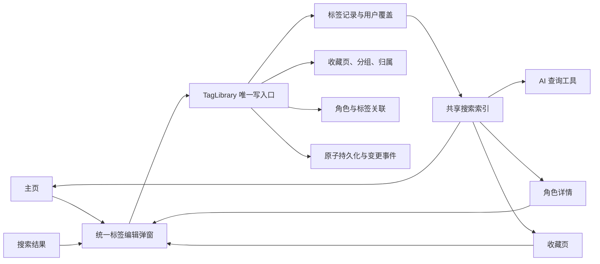

# 统一标签、收藏与角色标签：设计规范

日期：2026-09-19。状态：用户已同意统一方向，本文用于冻结详细设计；本轮只交付设计与计划，不修改运行代码，不迁移真实用户数据。

项目：`F:\codex\AI绘画Tag工具箱\ai-tag-release-v143`。当前应用基线：V1.4.316。不得在同一会话之前的“演示模拟”项目内实施本方案。

配套执行计划：[统一标签系统实施计划](../plans/2026-09-19-unified-tag-library.md)。

## 1. 目标与边界

主页、收藏页、角色详情、搜索结果和 AI 标签工具共享同一个标签记录。同一个标签无论从哪里打开，使用同一个标签编辑弹窗；保存一次，所有引用显示最新内容。收藏只新增收藏归属，不复制标签文本。

角色库保留角色资料和关联关系，收藏页保留页面/分组/布局；它们成为同一词库的不同视图。原有图片、翻译模型、AI 推理、ComfyUI 执行和历史会话不在此次重构范围。

本轮必须完成：统一数据、稳定 ID、统一增改接口、收藏位置选择器、统一编辑器、角色专属词接入、搜索开关、旧数据迁移、导入导出兼容、实际桌面交付。不能只重绘弹窗而继续维护两份可编辑内容。

本轮不做：云同步、多人编辑、第三层收藏目录、完整电子表格、任意 Prompt 语法解析器、自动语义合并、AI 推断成人标记、大量新增 UI 框架。

## 2. 已核实的当前实现

以下是 2026-09-19 读取源码和随包数据的结果，不是新功能的测试结果。

| 位置 | 当前行为 | 需要改变的原因 |
| --- | --- | --- |
| `src/modules/tags.js` | 普通 Tag、名称、别名、分类和用户覆盖；`edit()` 强制保留旧英文内容 | 表单可改 Tag，但底层可能忽略新内容；缺备注和搜索开关 |
| `src/modules/favorites.js` | 另存 `rawText/title/zh/aliases/note/globalSearchable/nsfw` | 同一 Tag 被复制后独立编辑，无法保证同步 |
| `src/modules/characters.js` | 通用特征读取 tags，专属特征读取独立 terms；另存角色覆盖和搜索缓存 | 专属词编辑不通、共享名称与角色索引可能不同步 |
| `src/views/characters-view.js` | 专属词的铅笔也调用 `tags.edit()` | 被编辑的词可能不在 tags 中 |
| `src/app-view.js` | 主页 `openTagEditor()`；另拼接收藏搜索结果 | 重复编辑 UI、重复结果和不同选中来源 |
| `src/views/favorites-view.js` | 右侧编辑器、空白处快捷编辑器、自动保存 | 与用户要求的统一弹窗和明确保存不一致 |
| `src/modules/storage.js` | root JSON 缓存后延迟写盘，写失败可保留新内存值 | 不能直接把 `set()` 当跨模块原子提交成功 |
| `src/modules/primary-tools.js` | Tag 搜索后另附收藏；角色名命中再附角色数据 | 必须统一搜索资格、ID、去重和取词方式 |

当前随包加载结果：19,692 条主页 Tag，其中 4,959 条角色名 Tag；角色源文件 33,599 条角色，专属词 804 条。角色库还会保留旧词库中的角色补充记录。新的总数由构建报告确定，不能将这些数字相加后直接当成无重复总数。

## 3. 相对旧设计明确改变的规则

2026-09-18 收藏设计中的以下规则被本规范覆盖；其他布局、排序、复制、备份和容错能力继续保留。

| 旧规则 | 本轮新规则 |
| --- | --- |
| 收藏条目自己持有内容，多个副本独立编辑 | 收藏归属指向唯一标签；同一标签跨分组共享内容 |
| 右侧编辑与约 300ms 自动保存 | 一个统一弹窗，点击保存才提交；取消不写数据 |
| 关闭全局搜索仍能从收藏内部搜索到 | `searchable=false` 对所有“发现式搜索”生效；分类/分组浏览及明确 ID 读取仍可用 |
| 收藏选择保存独立文本快照 | 新产生的结构化选择引用实时标签；已发送任务/历史 Prompt 保留原快照 |
| 收藏单词不注册到主页词库 | 收藏新内容先创建统一标签，再设置收藏位置；收藏已有标签只设置归属 |
| 复制条目默认为独立内容副本 | 跨分组添加引用共用内容；另设明确的“另存为独立标签”，不能混淆 |

这些是本轮行为变化，验收时要修改对应旧测试的预期，不能保留相反的两套产品规则。

## 4. 用户界面合同

### 4.1 名称与层级

- 普通分类使用“标签分类 → 子分类”。
- 收藏位置使用“收藏页 → 收藏分组”；分组沿用现有竖栏样式。只改文案和归属逻辑，不重新设计整页布局。
- “名称”统一称“显示名称”，与发送到模型的“Tag 内容”分开。
- “查询关键词”统一称“搜索别名”；一个别名可以是完整短语，不按空格强行切分。
- 旧“系列/sections/标签栏”内部字段通过适配层处理，新用户界面不混用术语。

### 4.2 统一编辑弹窗

```text
编辑标签 / 新建标签                     ×
类型：单标签 / 组合                     收藏状态：已收藏 / 未收藏

Tag 内容*        [实际复制/发送的文本；组合支持多行]
显示名称         [中文名或自定义名称]
搜索别名         [多个词条，可逐项添加/移除]
备注             [悬停说明，多行]

当前位置         标签分类 / 子分类（只读摘要）
收藏位置         收藏页 / 收藏分组（已收藏时显示）
[移动到…]        [收藏… / 取消收藏]

[ ] 成人内容     [✓] 允许搜索
提示：共享标签的修改会同步到引用它的位置。

[恢复默认（内置标签）]   [取消]   [保存]
```

明确行为：

1. 主页铅笔、收藏铅笔、角色特征铅笔、搜索结果铅笔打开同一个组件实例。
2. Tag 内容是必填。显示名称、别名、备注可清空；清空是明确覆盖，不能被 `value || original` 自动恢复。
3. 未收藏时，“移动到…”选择标签分类/子分类；已收藏时选择收藏页/收藏分组。两个层级都支持就地新建。
4. 原标签分类仍独立保存，收藏不会使标签从原分类消失。已收藏时可以通过只读分类摘要旁的“调整标签分类”使用同一个位置选择器的分类模式，避免先取消收藏才能分类。
5. 从某个收藏分组打开编辑器时，移动只改变该归属；从主页打开且存在多个收藏归属时，先选要移动的那一项。不能随机选第一个分组。
6. 标签可加入多个收藏分组，但同一标签在同一分组至多一个归属。多个归属不拥有各自的名称/备注，均读取统一记录。
7. 收藏页空白新增格打开同一弹窗的 create 模式，预填所在页/分组；保存前不创建标签或空归属。
8. 弹窗内“新建分类/分组”先保存为弹窗草稿，随最终保存一起提交；取消整次操作不留下空结构。独立页面菜单的新建操作则单独提交。
9. 保存期间禁用重复提交，成功后关闭并回到触发按钮；失败保留输入与错误提示，允许重试。
10. IME 组合期间 Enter 不保存；多行内容使用 Enter 换行，Ctrl/Cmd+Enter 保存。Esc/遮罩/切路由/关窗口遇未保存修改时显示“保存 / 放弃 / 返回编辑”。
11. 备注用纯文本 tooltip 展示，键盘焦点也能访问；不以 innerHTML 渲染用户内容。
12. 删除含义分清：“取消收藏”仅移除指定归属；“删除标签”是独立危险操作，有引用时禁止静默删除并列出引用位置；角色“移除特征”只移除关系。

### 4.3 收藏位置选择器

```text
收藏到…
收藏页      [已有页 ▼]      [+ 新建收藏页]
收藏分组    [已有分组 ▼]    [+ 新建分组]
当前标签：蓝发
[取消] [确认收藏]
```

- 点击收藏后不跳转整页，不打开旧右侧编辑区。
- 已经收藏到目标分组时返回“已在此分组”，不新增记录，不改顺序。
- 默认预选上次有效位置；位置已被删除时重新选择，不静默新建同名结构。
- 选择父级后清除不属于该父级的子项。
- 选择器与编辑弹窗共享位置组件和数据校验。
- 收藏关系、必要的新页/分组和新标签（如有）在一次提交中完成。

## 5. 唯一数据来源

生产运行只允许一个 `TagLibrary` 实例拥有标签内容。`tags/favorites/characters` 保留对外入口，内部改为同一实例的查询或命令适配器。



### 5.1 标签记录（运行时有效记录）

以下为 JS/JSDoc 合同，实际工程继续使用 CommonJS，不要求迁移 TypeScript。

```ts
type TagRecord = {
  id: string;                         // 稳定 ID，改内容或名称不变
  kind: 'tag' | 'bundle';
  content: string;                    // 复制和发送的唯一内容来源
  displayName: string;
  aliases: string[];
  note: string;
  adult: boolean;
  searchable: boolean;
  categoryId: string;
  subcategoryId: string;
  usages: ('general' | 'characterIdentity' | 'seriesIdentity' | 'characterSpecific')[];
  source: { kind: 'bundled' | 'custom' | 'legacyFavorite'; key: string | null };
  revision: number;
  createdAt: number;
  updatedAt: number;
};
type Category = { id: string; name: string; order: number; source: 'bundled' | 'custom' };
type Subcategory = { id: string; categoryId: string; name: string; order: number; source: 'bundled' | 'custom' };
type FavoritePage = { id: string; name: string; order: number; color: string; colorMode: 'auto' | 'custom' };
type FavoriteGroup = { id: string; pageId: string; name: string; order: number; color: string };
type FavoriteMembership = { id: string; tagId: string; groupId: string; order: number; pinned: boolean };
type CharacterLinks = {
  characterId: string;
  identityTagId: string;
  seriesTagIds: string[];
  generalTagIds: string[];
  specificTagIds: string[];
};
```

注意：

- `isFavorite` 是 `memberships.some(m => m.tagId === id)` 的派生值，不在两个地方重复写布尔标记。
- 角色身份 ID 与 Tag ID 是两种身份，允许当前值相同，但不能再以“必定同名”作为关联规则。
- 角色显示名称和搜索别名从身份 Tag 读取，不能继续在角色覆盖里再存一份权威名称/别名。
- `usages` 用来标记词的用途，不是另一份词表。角色专属词也由同一个 `getTag(id)` 读取。
- 角色关系保留通用/专属的分组，支持默认选择语义；不自动把角色全部特征加入提示词。
- 收藏组合的 `content` 保留原始大小写、空白、权重括号、转义和换行。判断空白可用 trim，存储不能用 trim 后的文本覆盖原文。
- 一个组合是一个独立共享条目；首版不逐词引用组合内部成员。修改“蓝发”不会偷偷改写用户保存的任意复杂组合文本。
- 不自动合并相似英文、不同作品同名角色、不同权重组合或只有显示名称一致的记录。

### 5.2 ID、覆盖与恢复默认

1. 内置 Tag 尽量保留现有稳定 ID；新增记录使用宿主生成的 `tag:<UUID>`，不能在每次内容改名时重新生成 ID。
2. 原有 `tagKey()` 继续作为搜索/旧 ID 查找规范化工具，不再决定编辑后记录的身份。
3. 角色源、专属词和作品词冲突时，构建器分配命名空间 ID 并记录映射，不能覆盖已有普通 Tag。
4. 内置基础记录是只读；用户覆盖只记录明确修改的字段。别名支持显式替换和清空，不能每次 rebuild 又把已删别名并回来。
5. 新增字段默认：普通/角色身份/作品词 `searchable=true`；原角色专属词 `false`；新建标签/组合 `true`。
6. 恢复默认只恢复 Tag 内容字段、别名、备注、成人/搜索标记及原分类；不取消收藏、不移除角色关联、不重排收藏。
7. 新增或改名遇已有相同单 Tag 内容时，提示已有记录并可选择引用；独立版本必须明确选择“另存为独立标签”。普通保存不能暗中把两条数据合并。

## 6. 存储、提交与通知

### 6.1 文件与状态

- 新文件：`%APPDATA%/ai-tag-toolbox-rewrite/tag-library-v2.json`。
- 保留 `rewrite-storage.json` 中与 AI/图片/设置/会话有关的内容；不整体重写这些模块。
- 内置完整种子随包放 `assets/数据资产/标签/unified-tag-base.json`，及 `unified-tag-manifest.json`（schemaVersion、源 hash、映射数量）。
- 用户文件保存自定义标签、字段覆盖、分类覆盖、收藏结构/归属、角色关系覆盖、选择引用、迁移映射和未解决冲突；不每次修改都把约数万条内置词库复制到磁盘。

```ts
type LibraryDocument = {
  schemaVersion: 2;
  libraryId: string;
  revision: number;
  baseFingerprint: string;
  customTags: TagRecord[];
  tagOverrides: { tagId: string; patch: TagPatch; revision: number; updatedAt: number }[];
  customCategories: Category[];
  customSubcategories: Subcategory[];
  categoryOverrides: { id: string; name?: string; order?: number }[];
  subcategoryOverrides: { id: string; name?: string; order?: number }[];
  favoritePages: FavoritePage[];
  favoriteGroups: FavoriteGroup[];
  memberships: FavoriteMembership[];
  characterOverrides: CharacterLinks[];
  selection: SelectionRef[];
  recentTagIds: string[];
  migration: MigrationReceipt | null;
  unresolved: PreservedLegacyRecord[];
};
type TagPatch = Partial<Pick<TagRecord, 'kind' | 'content' | 'displayName' | 'aliases' | 'note' | 'adult' | 'searchable' | 'categoryId' | 'subcategoryId'>>;
type SelectionRef =
  | { kind: 'tag'; tagId: string }
  | { kind: 'character'; characterId: string; includeSeries: boolean; generalTagIds: string[]; specificTagIds: string[] }
  | { kind: 'legacySnapshot'; id: string; content: string; displayName: string; adult: boolean };
type PreservedLegacyRecord = { id: string; sourceKey: string; sourceId: string | null; reason: string; payload: unknown };
type MigrationReceipt = {
  id: string; sourceFingerprint: string; completedAt: number;
  tagIdMap: Record<string, string>; favoriteIdMap: Record<string, string>; characterIdMap: Record<string, string>;
  counts: { sourceTags: number; sourceFavorites: number; linkedFavorites: number; independentFavorites: number; unresolved: number };
};
```

### 6.2 写入规则

统一 `execute(command, options)`：先校验 → 构造候选文档 → 检查 ID/引用/数据合法性 → 写同目录临时文件 → flush 文件 → 原子替换正式文件 → 发布内存新版本 → 发出一条变更事件。

- `repository.save()` 返回前，界面不能显示“已保存”。写失败保持旧文档，弹窗保留草稿，不广播成功。
- 使用提交队列避免写盘顺序反转；编辑保存带 `expectedRevision`，发现新版本返回 `REVISION_CONFLICT`，提示重新载入，不覆盖别处修改。
- 选择/取消选择属于按 ID 的幂等命令，可在队列内基于最新状态合并，不以整份旧 selection 覆盖新 selection。
- `operationId` 在一次弹窗保存/重试中固定；同一 ID 同内容只提交一次，换内容重用 ID 拒绝。跨重启不自动重发未完成操作。
- 临时文件、备份、目标文件都必须在固定用户目录；不能接受模型或导入文件指定任意磁盘路径。
- 写前保留最近有效 `.bak`；启动时校验主文件，损坏时只读报告并提供从备份恢复，不能静默当成空库覆盖。
- 单实例保护：主进程使用现有 Electron 单实例机制或补 `requestSingleInstanceLock()`，第二个进程只激活现有窗口，避免两个版本同时写同一新库。
- Windows 下旧版正在运行时不强杀、不删除占用目录；先准备新版，关闭旧版后才允许激活迁移。

### 6.3 通知与历史

`LibraryChange` 包含 `revision/changedTagIds/changedCharacterIds/changedMembershipIds/structureChanged`。Tag 内容改变时，通过反向索引找到受影响角色和收藏归属，更新缓存和 UI。异步刷新不能覆盖编辑弹窗中的未保存输入。

统一撤销/重做最多保留最近 30 次用户内容/结构操作，保存受影响记录的差量；一次弹窗保存是一条操作。撤销也走持久化队列和引用校验。输入框 Ctrl+Z 优先使用原生文本撤销。迁移不加入日常撤销栈，回退使用迁移前备份。

## 7. 搜索合同

### 7.1 一个索引，多个查询范围

查询范围：`all`（主页/AI）、`favorites`（有收藏归属）、`characters`（角色身份）、`characterTraits`（指定角色的可搜索关联词）。结果统一带 `tagId/kind/content/displayName/aliases/adult/searchable/favoriteLocations/characterId?`。

- 有非空 query 的发现式搜索都排除 `searchable=false`；空 query 分类/分组浏览可显示它们，并带“不参与搜索”的标记。
- 成人过滤独立于 searchable；关闭成人显示时，搜索、浏览、角色附带特征和 AI 输出全部过滤成人项。
- 精确 ID 读取只供已知对象的编辑、浏览、明确选中后的角色组装使用；AI 的普通搜索工具没有 bypassSearchable 开关。
- 搜索索引默认包含内容、显示名称、显式别名；备注不作为全局/AI 搜索字段。收藏内部保留按分组名称/备注检索的能力，但仍遵守 searchable 和成人过滤。
- exact/standard/broad 搜索精度沿用现有规则；broad 的分类关键词也必须通过同一资格过滤。
- 查询到同一个 tagId 时主页只显示一次；收藏位置以徽标/定位入口表达。收藏页按所在分组浏览可以显示同一 Tag 的多个归属。
- 修改、恢复默认、导入、成人/搜索标记改变时同步失效所有相关缓存，不能等重启才生效。
- 角色列表搜索使用最新身份 Tag 名称/别名，不能继续读取加载时的旧索引。
- 悬停备注和搜索高亮使用 textContent/text node；不得把存储内容解释成 HTML。

### 7.2 角色查询和 AI

普通 `tags.search` 的角色身份命中可以提供 `characterId/series` 摘要；完整关联词在明确读取该角色时解析。专属词默认不作为独立全局结果，但可以随用户已选择的角色作为关联数据提供。这里的 searchable 不是保密或访问权限。

AI 的两个现有工具名 `tags.search/characters.search` 保留，输出从统一库投影。组合要标 `kind=bundle`，保留原文并明确是否截略；不能把组合伪装成一个普通英文词。翻译匹配只查询单标签，并遵循共享的别名和搜索资格。

工具参数不得新增任意写库功能；本次只统一既有查询与输出。更新 `primary-agent.js` 的收藏说明，避免继续告诉模型“收藏与词库是两套内容”。已有模型请求和历史生成任务使用任务开始时捕获的文本，后续编辑不追溯改写历史。

## 8. 选择与 Prompt

- 主页和收藏点击同一个 Tag，使用同一选中身份，不重复添加。
- 未发送的结构化选择只存 ID；Tag 编辑后立即更新底部显示和导出文本。
- 角色选择保留身份和用户显式勾选的特征 ID；公共特征内容更新会更新未发送的角色输出；取消某角色不会删除另一个角色共享的特征关系。
- 普通单标签的括号转义只在输出边界处理一次；编辑器仍显示未经重复转义的原始内容。
- 组合原文作为整体加入，保持权重/括号/转义/换行；不自动解析或去重组合内部词语。
- 已手工编辑的 Prompt 输入框、历史聊天、已经提交的出图任务和图片元数据保持原快照。
- 旧收藏选择快照若与当前记录不同，迁移为带“旧选择快照”提示的 `legacySnapshot`，可显式替换为当前标签或移除，不能静默改变待发送文本。

## 9. 角色资料的边界

- 保留作品、热度、角色 ID、来源和角色特征关系；角色资料不是普通 Tag 的复制品。
- 名称/别名/成人/搜索状态从身份 Tag 读；角色编辑对应字段时同样修改身份 Tag。
- 作品名称可引用 seriesIdentity Tag；改变作品词内容不改变作品的稳定关联 ID。
- 804 条原专属词全部进入统一种子，保留 `specific:*` ID 或显式迁移映射；默认 searchable=false。
- 公共词可以同时被多个角色关联；只移除某个关联，不删除公共词。
- 角色特征编辑弹窗显示“正在修改共享标签，关联 N 个角色”；此为影响提示，不要求每次重复确认。
- 对新增加的“该角色特征”先选择已有标签或用统一创建流程新建，再写关联；不能允许悬空 ID 或凭字符串伪造存在的词。
- 角色搜索缓存订阅标签变更；名称/别名/成人/搜索状态更新后立即生效。
- 不重新添加 V1.4.316 已移除的角色列表行星标。

## 10. 旧数据迁移与恢复

### 10.1 迁移输入

只读取所需键：`rewrite_custom_tags`、`rewrite_selected`、`rewrite_tag_edit_history_v1`、`favorites_shelf_v1`、`favorites_selection_v1`、`favorites_recent_v1`、`rewrite_favorites`、`rewrite_character_edits_v1`、`rewrite_character_selection_v1`、`rewrite_character_edit_history_v1`。原存储的实际外层键是 `ai-tag-toolbox-rewrite:app:<key>`，值为 JSON 字符串，必须按这两层分别校验。

源数据是 Electron 用户目录，不是应用安装目录。规划和测试使用构造夹具或脱敏副本，不在这轮计划阶段读取、修改、打包用户真实数据。

### 10.2 迁移顺序

1. 严格解析旧存储文件；损坏时中止并报告，不经过旧存储“错误即空对象”的兜底覆盖数据。
2. 提取标签/收藏/角色相关键，生成 hash。先把这部分原始数据以独占文件写入用户目录的 migration-backups，再生成候选新文档。
3. 加载统一内置种子，映射现有 Tag/角色/作品/专属词稳定 ID。
4. 应用旧主页自定义词与覆盖，保留改名、显式空值、分类、别名和成人标记。
5. 转换角色资料编辑和特征关系；无法解析的旧特征 ID 保存为待处理记录，界面告知，不静默丢失。
6. 转换收藏页与分组，保留 ID、名称、颜色、顺序、置顶。旧根部条目落入该页的默认分组；只在确有根部条目时建立该分组。
7. 转换收藏条目为标签+归属，按下表处理相同内容与冲突。
8. 转换选择引用、最近使用 ID；旧快照差异保留为 legacySnapshot。
9. 校验所有引用、数量、原文字节和成人/搜索状态，生成迁移报告。
10. 原子写入新文档；写成功才切换运行入口。旧键不删除、不继续双写。
11. 重启读取新 schemaVersion 和 sourceFingerprint，确认已迁移后不再重复导入旧收藏。

步骤 10 写入前重新读取所需旧键的 fingerprint；若旧版仍在写入造成变化，返回 `LEGACY_CHANGED_DURING_MIGRATION`，保留备份且不激活过时的新库，提示关闭旧版后重试。

### 10.3 合并与冲突规则

| 情况 | 处理 |
| --- | --- |
| 有有效 sourceTagId，内容和用户可编辑字段完全一致 | 引用该共享 Tag，不复制内容 |
| sourceTagId 有效，但收藏内容/名称/备注/别名/成人/搜索标记不同 | 保留独立 legacyFavorite 标签和来源映射，报告差异；不覆盖主页 |
| 没 sourceTagId，但单 Tag 精确内容唯一匹配、全部元数据无冲突 | 可引用同一记录，报告“精确匹配关联” |
| 只有名称相同、模糊内容相似或匹配多个候选 | 保持独立，不自动合并 |
| 组合/复杂 Prompt/带权重/多行文本 | 整体导入为 bundle，不按逗号拆开 |
| 同一标签在不同分组，字段完全一致 | 多个归属指向同一 Tag |
| 同一分组完全重复的同一标签归属 | 合并冗余归属，旧 membership ID 映射到保留项，报告数量变化 |
| 空/损坏/超出新编辑长度限制的旧条目 | 原样保存于 unresolved，迁移报告提供导出和修复入口，不伪造有效标签 |
| 旧 title 和 zh 均非空且不同 | title 作为显示名称，zh 进入别名（若无冲突）；原值同时保留在迁移备份 |

旧 globalSearchable=false 映射 searchable=false，报告说明现在也影响收藏内部搜索；该项仍可浏览。角色专属词默认 searchable=false 保持原来全局不可发现的行为。

### 10.4 回退

迁移失败保留旧数据，展示错误，允许重试或导出诊断摘要。已经成功迁移且产生新修改后，不自动回到旧存储；回退需先导出当前新库。旧版本不能理解 v2，交付说明明确“切换旧程序会看到旧数据，不会自动同步新修改”。

## 11. 新建、移动、批量与导入导出

- 所有入口最终走同一命令服务；收藏 API 不再保存 rawText 等副本。
- `移动` 仅变更分类或归属；`添加到其他分组` 新增引用；`另存为独立标签` 才创建内容副本。
- 批量移动/成人标记/搜索开关/取消收藏/置顶都一次事务，冻结操作对象 ID，不能只处理当前渲染页。
- 删除收藏页/分组先显示受影响归属数量；默认移动到“未分类”收藏页/分组，彻底取消其中收藏是单独选项；都不删除底层标签。
- 导出格式 `ai-tag-library`、version=2，可全库或仅收藏。仅收藏导出携带被引用 Tag 定义，不能只导出指向本机的 ID。
- 新导出保留共享关系、角色关联映射、分类/分组、搜索/成人状态、内容原文；不包含 API Key、图片、聊天或设备路径。
- 导入先 preview：新增/引用/冲突/无效数量及来源，再确认 commit。文件上限 32 MiB，超限清楚提示，不部分应用。
- 支持旧收藏 v1 与现有粘贴格式，通过同一迁移转换器进入新库。未知版本拒绝；外部 ID 冲突且内容不同则生成新 ID 并重写本次导入引用。
- 旧版导出若保留为“兼容旧版收藏导出”，明确只能保存内容快照，不能承诺维持共享引用。

## 12. 校验与性能要求

新写入限制：content 最多 32,768 个 JS 字符且不能全空白；displayName 256；note 4,096；aliases 最多 64 项、每项 256；页/组/分类名最多 80 且不能全空白；顺序为非负整数；颜色沿用 HEX 规则。

已有超限内容通过迁移保留，不以新上限截断。模型返回或导入对象的未知可写字段拒绝；source/ID/revision 由宿主生成或受控迁移，普通编辑不能覆盖。

构建种子、加载 v2、按页查询和搜索应复用现有缓存，不能每次按键重建全量词库或每个 DOM 行读取磁盘。一次保存至多一次持久化提交、一条公共变更事件；重建受影响索引即可。记录 V1.4.316 和新版本在同一台机器的启动数据加载、首次搜索、重复搜索和 10,000 收藏夹具的 p50/p95，避免用仅 2 条记录的测试判断性能。

禁止引入无关依赖、远程资源、通用数据库服务器。保持现有 Electron/CommonJS/原生 DOM/CSS/node:test/JSDOM 工具栈。

## 13. 验收合同

| 编号 | 完成标准 |
| --- | --- |
| U01 | 收藏已有 Tag 后唯一标签数量不变，只新增归属 |
| U02 | 主页、收藏、角色特征、搜索结果调用同一编辑器，七类字段一致 |
| U03 | 改 Tag 内容不改变 ID，所有关联读取新内容 |
| U04 | 新建普通标签/收藏空白格均走同一创建命令，取消不写任何对象 |
| U05 | 收藏和移动选择器支持已有页/分组及就地新建，父子关系合法 |
| U06 | 未收藏/已收藏移动模式正确，多归属不随机移动 |
| U07 | 名称/别名/备注可清空，已删除别名不会从基础数据重新出现 |
| U08 | searchable=false 在主页、收藏和 AI 发现式搜索都不可见，浏览仍可见 |
| U09 | 成人过滤覆盖浏览、搜索、角色特征和 AI 输出 |
| U10 | 同一 Tag 全局搜索不重复，收藏徽标和定位正确 |
| U11 | 角色专属词进入统一存储，可编辑/收藏；默认不作为独立全局搜索结果 |
| U12 | 从角色移除关联不删公共词；修改共享词更新所有关联角色 |
| U13 | 角色名称/别名修改立即影响角色列表、搜索和 AI 角色查询 |
| U14 | 取消收藏不删 Tag；删除有引用的 Tag 明确阻止或按明确解除流程处理 |
| U15 | 组合原文与权重/转义/换行逐字保留，不自动拆分 |
| U16 | 保存失败/重试/双击/并发修改/关闭窗口不丢数据、不重复新增 |
| U17 | 迁移可重复启动且只执行一次；差异收藏、旧快照、无效记录均保留 |
| U18 | 新旧格式导入导出、ID 冲突、取消导入、32 MiB 上限均有正确结果 |
| U19 | 未发送结构化选择实时更新；历史请求/手改 Prompt 不被追溯改写 |
| U20 | 右侧旧收藏编辑器和空白快捷编辑器移除；没有残留自动保存定时器 |
| U21 | 分类/收藏布局、分页、顺序、颜色、置顶、复制和撤销/重做继续可用 |
| U22 | UI 没有 Node/磁盘/存储直连；只有一个生产 TagLibrary 写入口 |
| U23 | 306 项旧测试的仍有效行为保留，变更预期均注明对应新合同，新增关键行为测试通过 |
| U24 | 桌面 exe/源码副本/asar/版本一致，用户数据不打包；实际窗口验收状态如实记录 |

## 14. 项目约束与执行纪律

- 保留项目现有未跟踪 `%SystemDrive%/` 目录，不清理或当作本次源码提交。
- 必跑 `npm run check`；默认不跑 `--uitest/--smoke/--i18ntest/test:regression` 等启动应用的慢测。既有 npm check 内的 `tests/regressions-v194.cjs` 照常运行。
- 真实 Electron 操作由用户人工验收；DOM/静态/模块测试不能写成真人窗口验收通过。
- 不调用真实付费 API、不发网络消息、不 push、不发布 Release。
- 按仓库规则做小步本地提交，提交只包含本任务文件。规划文档提交使用当前 V1.4.316，不提升应用版本、不重新发布桌面包。
- 实施完成的首个整体候选版暂定 V1.4.317；若执行开始版本已前进，以实际下一内部版本为准，运行代码/标题/桥版本/说明/asar 同步更新。
- 每一阶段有可观察退出条件；同一缺陷最多 2–3 轮修复，仍失败时保留证据并报告实际阻塞，不反复空等。
- 未启动的代理不能写成“正在等待”；代理返回完成后读 diff 与实际测试结果，不能仅复制代理总结。
- 本次规划不触碰运行文件、不触碰真实用户存储、不打包不完整版本。执行授权与验收均沿当前会话已有决定推进。
